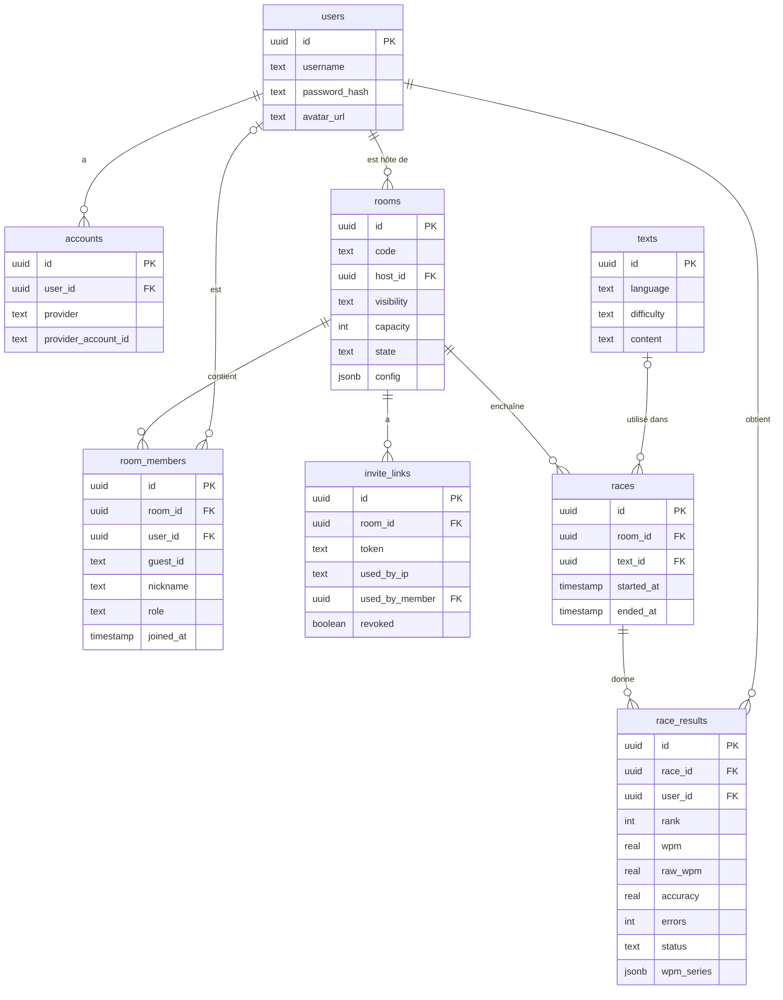
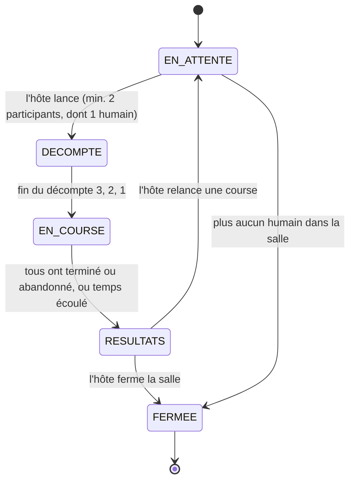

# Architecture

Version initiale (checkpoint 1). Pour l'instant, seulement la table `users` existe dans la base de données, le reste est ce que je prévois faire.

## Modèle de données

Quelques précisions :

- `accounts` sert pour les connexions Discord et GitHub. `password_hash` est null si le compte utilise seulement OAuth.
- Un membre de salle est soit un utilisateur connecté (`user_id`), soit un invité (`guest_id`, qui vient de son cookie signé). `role` est participant ou spectateur.
- Pour SALLE-06, il y aura une contrainte unique sur `user_id` et sur `guest_id` dans `room_members`, donc une personne ne peut pas être dans deux salles en même temps, même si l'interface a un bogue.
- La configuration de la salle est dans une colonne `jsonb` parce que ce sont beaucoup d'options qui sont toujours lues ensemble.
- `race_results` est seulement pour les utilisateurs connectés (RES-05). `wpm_series` garde le MPM dans le temps pour pouvoir réafficher les graphiques.
- La progression pendant la course n'est pas dans la base de données. Elle reste en mémoire sur le serveur et les résultats sont écrits une seule fois à la fin (PERF-02).

## Machine à états d'une course

- On peut rejoindre la salle seulement dans `EN_ATTENTE` et `RESULTATS` (SALLE-09), sinon on est spectateur.
- Le texte est envoyé aux joueurs seulement quand on arrive dans `DECOMPTE` (COURSE-03).
- C'est le serveur qui fait toutes les transitions. Le client ne fait que demander, et le serveur vérifie que c'est bien l'hôte (SEC-01).

## ADR 1 : Technologie temps réel

**Statut :** accepté

**Contexte :** Il faut que tout le monde dans une salle voit la liste des personnes, la configuration et la progression des joueurs en direct (TECH-06). Le joueur envoie aussi sa progression au serveur plusieurs fois par seconde, donc la communication doit aller dans les deux sens. Le serveur doit être la source de vérité (COURSE-06).

**Décision :** J'utilise des WebSockets avec Socket.IO, sur un serveur Node personnalisé qui roule dans le même processus que Next.js.

**Options considérées :**

| Option | Pourquoi oui / non |
| --- | --- |
| Socket.IO (choisi) | Bidirectionnel, les « rooms » correspondent directement à mes salles, et la reconnexion automatique m'aide pour COURSE-08. |
| WebSocket natif (`ws`) | Plus léger, mais je devrais refaire moi-même les salles et la reconnexion. |
| Server-Sent Events | Va seulement du serveur vers le client, donc il faudrait des requêtes HTTP à part pour la progression. |
| MQTT | Demande un broker en plus à installer et maintenir sur le serveur, c'est trop pour ce projet. |
| Service externe (Pusher, Ably) | Limites du forfait gratuit (TECH-08) et c'est plus difficile d'avoir un serveur autoritaire. |

**Conséquences :**

- Il faut un serveur qui reste toujours allumé, donc pas d'hébergement serverless. Ce n'est pas un problème puisque le déploiement doit être sur un VPS de toute façon (TECH-05).
- L'état des courses est en mémoire dans un seul processus. Si le serveur redémarre, les courses en cours sont perdues. Je trouve ça acceptable pour la taille du projet.
- Tous les messages reçus par le serveur seront validés avec un schéma Zod (TECH-07).

## Approche prévue pour les bots

Les bots vont rouler sur le serveur, dans la même boucle que la course. Pour le serveur, un bot est un participant comme les autres : sa progression est envoyée aux clients de la même façon que celle d'un humain, et il reçoit les bonus et malus aussi (BOT-04).

- Le moteur d'un bot sera une fonction pure : avec une graine (seed), un niveau et un texte, elle donne toujours la même séquence de frappes. Comme ça je peux le tester unitairement (BOT-05).
- Chaque niveau a une plage de MPM et un taux d'erreur, selon le tableau de BOT-01.
- La vitesse n'est pas constante : elle varie un peu au hasard autour du MPM visé, et le bot ralentit sur les mots longs ou avec des caractères spéciaux (BOT-02).
- Quand le bot fait une erreur, il perd du temps pour la corriger, selon le mode d'erreur de la salle (BOT-03).
