## Nom et logo
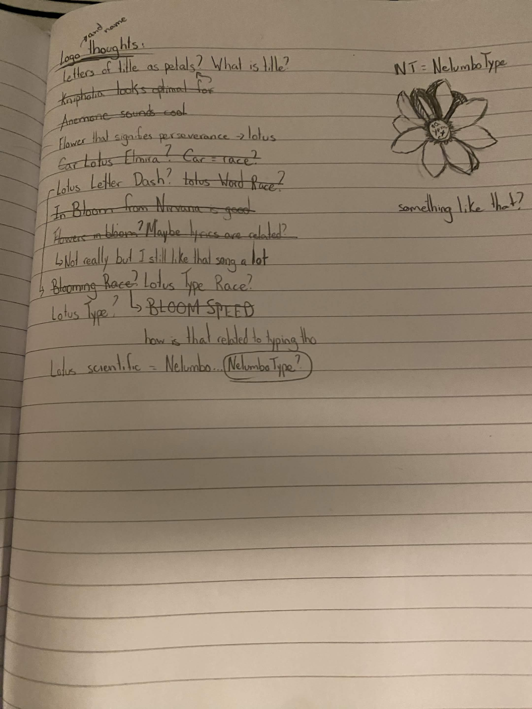
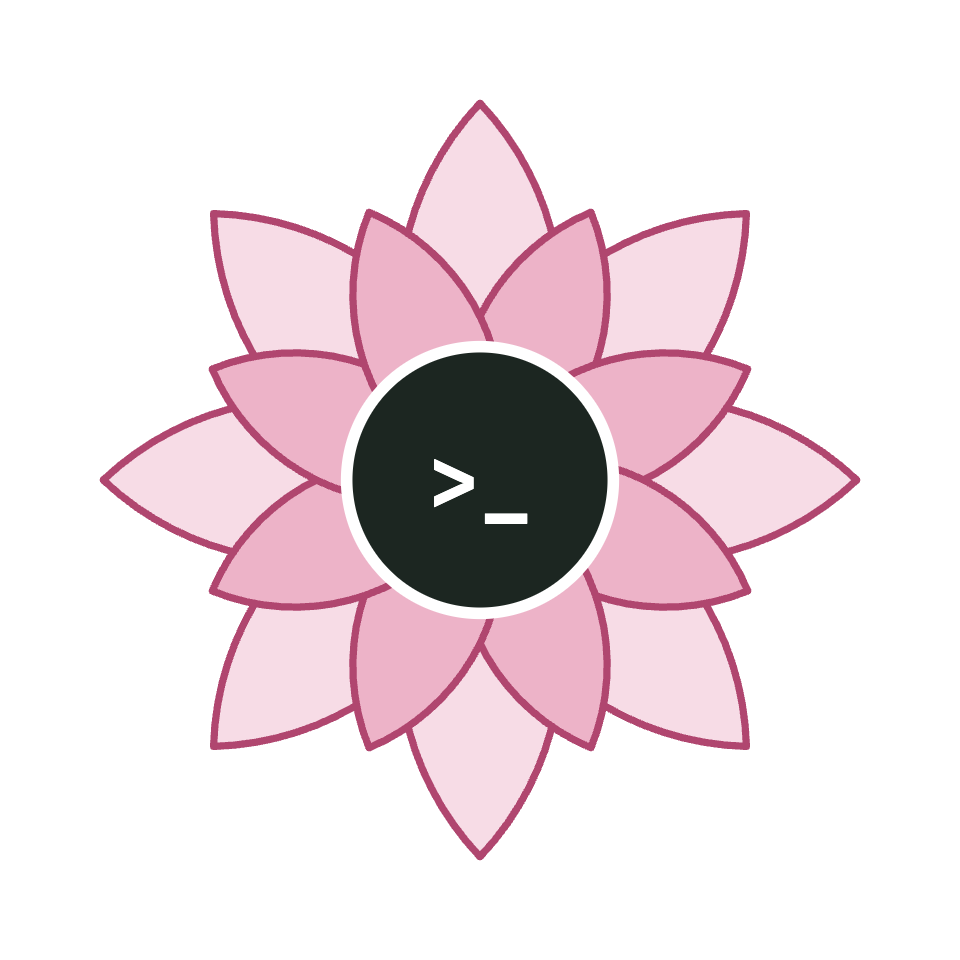
Je savais que je voulais un thème de fleur/plante pour mon typeracer, donc je voulais logo et nom qui reflètaient ceci. Ma démarche pour trouver le nom a été longue, mais j'ai finalement opté pour **NelumboType**; "Nelumbo" pour le nom de la famille des lotus et "Type" pour indiquer que c'est en rapport avec un typeracer.

Le logo est une fleur de lotus avec les symboles ``` > _ ``` à l'intérieur, qui est un peu le symbole pour écrire à l'ordinateur, comme dans un terminal. J'aurais voulu avoir un meilleur logo, mais mes talents en design sont assez limités, donc le mieux que j'ai pu faire est ceci:

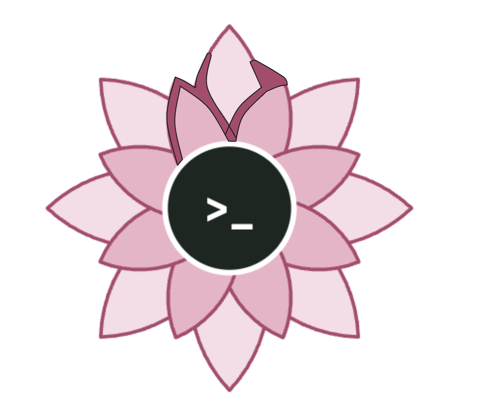
J'aurais ajouté les lettres "N" et "T" dans les pétales du haut, mais je n'ai pas eu le temps de mettre ce logo au propre.


## Moodboard

**#1** MonkeyType (https://monkeytype.com/):
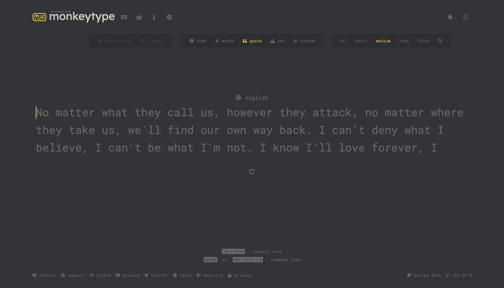
MonkeyType est une très grosse inspiration, puisque tout "flow" du texte à écrire et le style épuré du site est quelque chose que j'aimerais reproduire. C'est le site de pratique pour écrire sur lequel je me base le plus pour les mécaniques d'écriture, de choix de configuration, etc.

**#2** Kahoot (https://kahoot.com/)
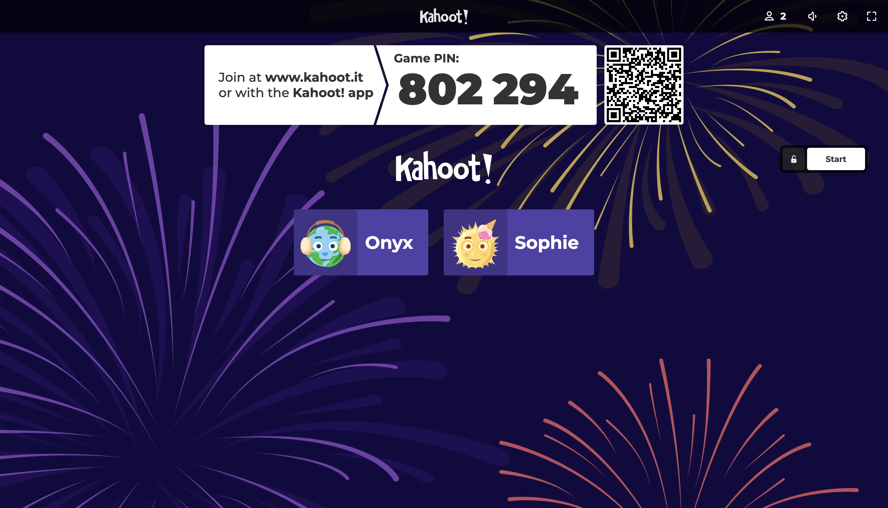
Je me base énormément sur Kahoot pour la page de salle. Je trouve que le style est simpliste, mais qu'il peut y avoir toutes les informations nécessaires dans cette page. Tout ce qu'il manque réellement, c'est un espace où afficher les configurations de la salle. Cependant, les informations importantes comme le nombre de participants, les participants eux-mêmes ainsi que leurs avatars et le code de la salle sont toutes présentes.

**#3** Dribbble - Leaderboard de Typerace par Son Nguyen (https://dribbble.com/shots/11382371-Typeracer-Leaderboard)
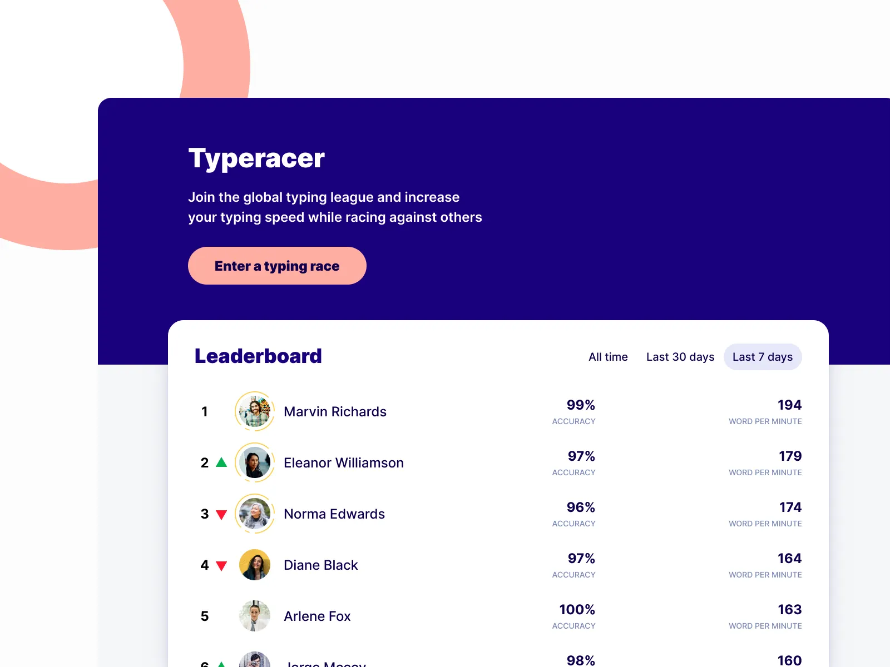
Il me faudra un leaderboard avec plus d'informations qu'un leaderboard normal de Kahoot, comme la précision, le nombre de mots par minute, le nombre d'erreurs ou le nombre de mots écrits, puisque c'est variable avec les bonus/malus.

**#4** Steam (https://steamdb.info/app/730/charts/)
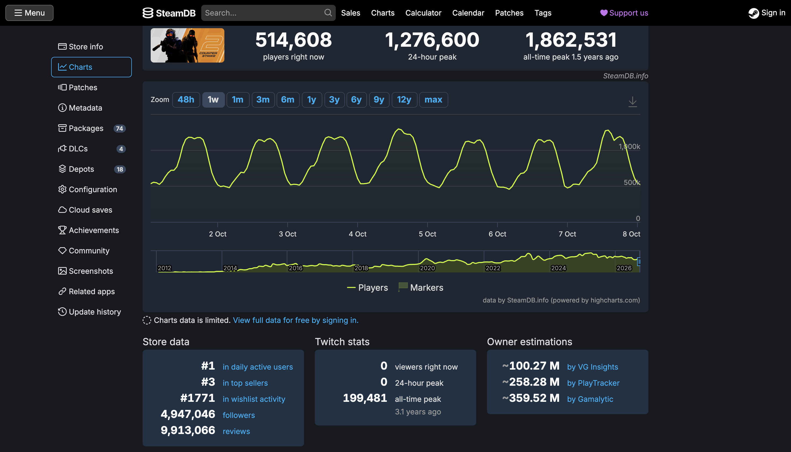
Je trouvais que la charte pour le nombre de joueurs actifs pour un jeu pouvait bien s'appliquer pour la page de statistiques personnelles d'un utilisateur. Il pourrait y avoir une charte avec le nombre de mots par minute des dernières courses, comme ça l'utilisateur pourrait facilement voir son amélioration. On peut également avoir d'autres statistiques intéressantes en bas, comme la vitesse maximale de l'utilisateur en écrivant en MPM et le nombre de courses et de victoires, entre autres.

**#5** Moi-même, Sophie-Anne
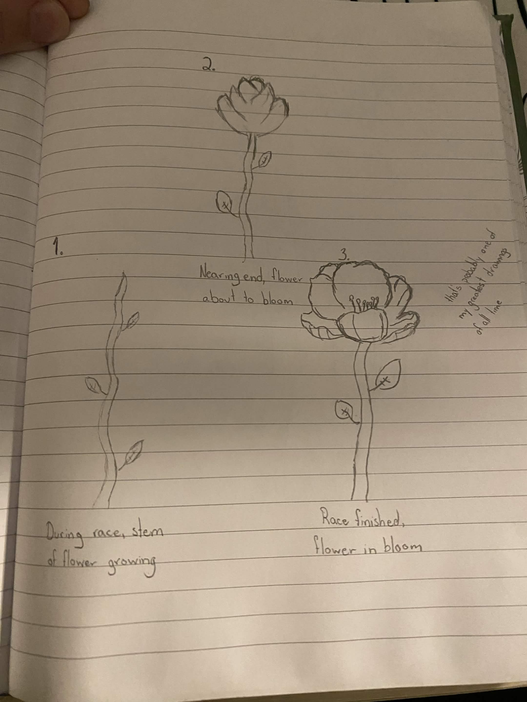
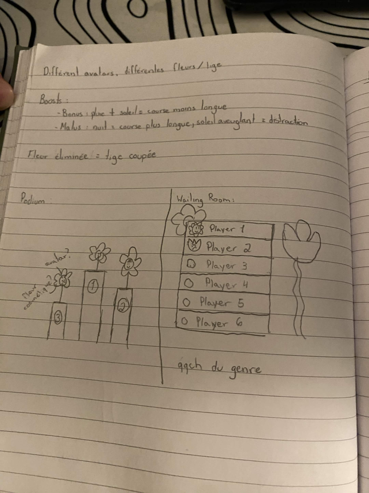
J'avais également dessiné à la main quelques concepts auxquels j'avais pensé, dont comment voir la progression d'un joueur lorsqu'il écrit. Je pensais faire des fleurs qui poussent au fur et à mesure que le texte est écrit, d'où le thème de fleurs. J'avais également pensé à quelques bonus/malus en lien avec le thème, comme un peu de pluie et de soleil pour signifier une course moins longue (donc plus rapide), la nuit qui pourrait signifier une course plus longue ou un soleil aveuglant comme distraction pour les joueurs dans les premières places.

## Palette de couleur et typographie
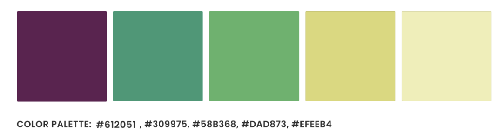

J'ai choisi une palette qui avait des couleurs plutôt floral, mais je voulais également que ce ne soit pas trop rose. Je voulais qu'il y ait un style un peu de feuillage, donc je voulais également des accents verts. Mes couleurs princiales seraient la deuxième et la quatrième, le reste serait des accents pour ces deux couleurs.

Pour les polices, j'en ai choisi qui allait bien avec mes couleurs, et j'ai également pris une police semblable à MonkeyType pour le texte qui sera généré et potentiellement pour les statistiques également.
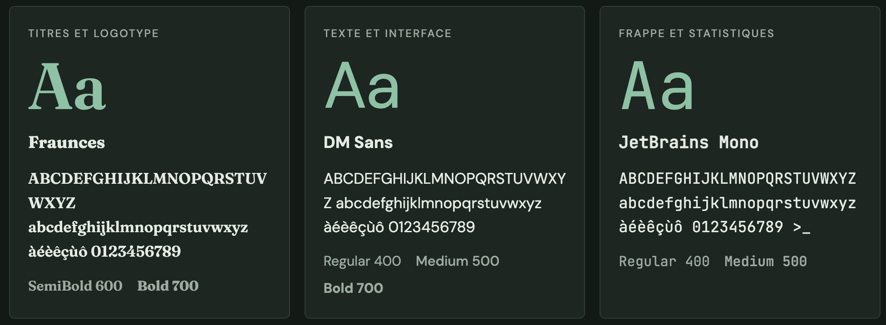